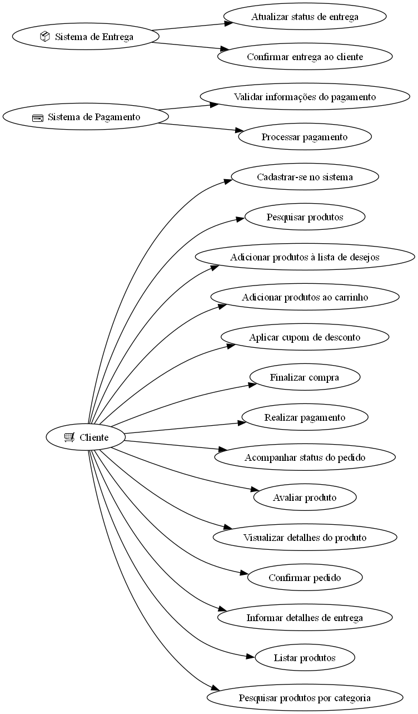
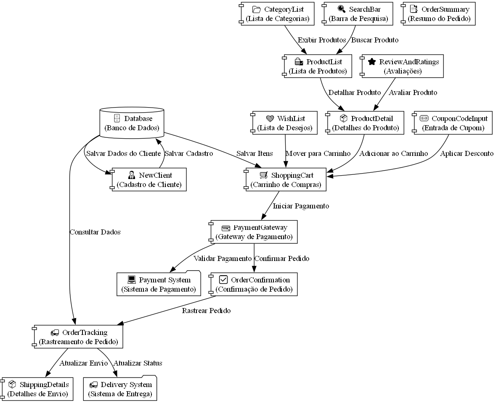
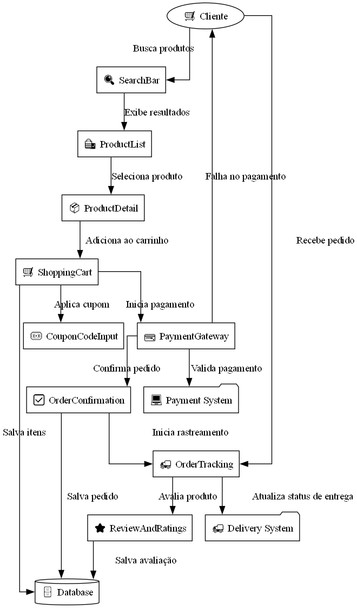
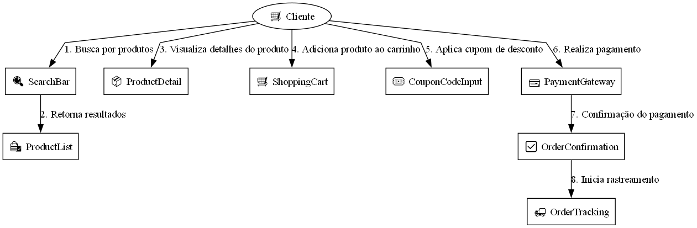

# 📊 **Project Diagrams - react-native-ecommerce-helper**

> ⚠️ **Note:** The **images** in this document are labeled in **Brazilian Portuguese** because they are part of a **Final Paper (TCC)**. However, the descriptions and explanations are provided in **English** to ensure clarity for a wider audience.

This document presents and describes the main diagrams used to represent the structure and operation of the **react-native-ecommerce-helper** library. These diagrams aim to provide a clear vision of the key components, interactions, and workflows of the system.

---

## 📝 **1. Use Case Diagram**

### 📚 **Description:**
The **Use Case Diagram** illustrates the interactions between **external actors** (Customer, Payment System, and Delivery System) and the **main functionalities** of the system. It describes the key features available to each actor.

### 🖼️ **Diagram:**


### 📌 **Code Reference:**
You can find the Python code used to generate this diagram here:  
➡️ [Use Case Diagram Code](../Diagrams/UseCases/DiagramaDeCasosDeUso.py)

---

## 📝 **2. Component Diagram**

### 📚 **Description:**
The **Component Diagram** represents the main modules and libraries of the project. It shows how each component is organized and how they communicate with each other.

### 🖼️ **Diagram:**


### 📌 **Code Reference:**
You can find the Python code used to generate this diagram here:  
➡️ [Component Diagram Code](../Diagrams/Components/DiagramaDeComponents.py)

---

## 📝 **3. Interaction Flow Diagram**

### 📚 **Description:**
The **Interaction Flow Diagram** illustrates how the main components interact throughout a typical system process, such as completing a purchase or updating an order status.

### 🖼️ **Diagram:**


### 📌 **Code Reference:**
You can find the Python code used to generate this diagram here:  
➡️ [Interaction Flow Diagram Code](../Diagrams/InteractionFlows/FluxoDeInteracoes.py)

---

## 📝 **4. Sequence Diagram**

### 📚 **Description:**
The **Sequence Diagram** describes the order of interactions between the system's components during a specific flow, such as searching for products or processing a payment.

### 🖼️ **Diagram:**


### 📌 **Code Reference:**
You can find the Python code used to generate this diagram here:  
➡️ [Sequence Diagram Code](../Diagrams/SequenceDiagram/DiagramaDeSequencia.py)

---

## 📝 **5. Architecture Diagram**

### 📚 **Description:**
The **Architecture Diagram** provides an overview of the system's layers. It details the **User Interface Layer**, **Business Logic Layer**, **Data Access Layer**, and how they connect with **External Services**.

### 🖼️ **Diagram:**


### 📌 **Code Reference:**
You can find the Python code used to generate this diagram here:  
➡️ [Architecture Diagram Code](../Diagrams/ArchitectureDiagram/DiagramaDeArquitetura.py)

---

## 🎯 **Importance of the Diagrams**

The diagrams play a crucial role in understanding, documenting, and validating the system. They enable developers, designers, and stakeholders to comprehend the relationships and responsibilities of the components involved in the project.

- 🔍 **Clarity:** Assist in understanding the system structure.  
- 🛠️ **Maintenance:** Facilitate future updates and corrections.  
- 📑 **Documentation:** Serve as technical reference for new implementations.

---

## 💻 **How to Generate the Diagrams**

1. Ensure the required Python packages are installed:
   ```bash
   pip install graphviz
   ```
2. Run the Python scripts in their respective directories:
   ```bash
   python DiagramaDeCasosDeUso.py
   python DiagramaDeComponents.py
   python FluxoDeInteracoes.py
   python DiagramaDeSequencia.py
   python DiagramaDeArquitetura.py
   ```
3. The images will be automatically generated in the specified directories.

---

If you need adjustments to the diagrams or wish to add more visual representations, feel free to reach out! 😊
