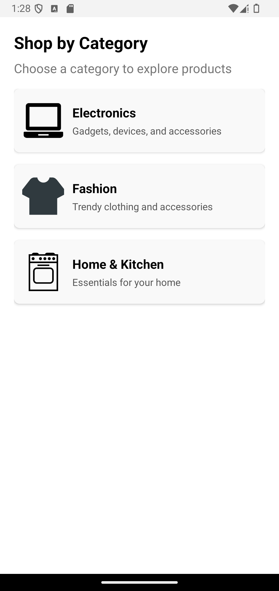

# 📚 **CategoryList**

The **CategoryList** component displays a list of product categories in an organized and customizable way.

---

## 📸 **Component Preview**

<table>
  <tr>
    <td><strong>CategoryList</strong></td>
    <td></td>
  </tr>
</table>

---

## 🛠️ **Props**

| Prop               | Type                           | Required | Description                                                                                                       |
| ------------------ | ------------------------------ | -------- | ----------------------------------------------------------------------------------------------------------------- |
| `categories`       | `Category[]`                   | ✅       | Array of category objects to display.                                                                             |
| `onSelectCategory` | `(category: Category) => void` | ✅       | Callback function when a category is selected.                                                                    |
| `title`            | `string`                       | ✅       | Title text displayed at the top of the list.                                                                      |
| `subTitle`         | `string`                       | ❌       | Subtitle text displayed below the title.                                                                          |
| `styles`           | `object`                       | ❌       | Custom styles for container, categoryContainer, categoryImage, categoryText, descriptionText, title and subTitle. |

### 📦 **Category Object Structure**

```ts
interface Category {
  id: string;
  name: string;
  image?: string;
  description?: string;
}
```

---

## 💻 **Usage Example**

### 📝 **Basic Example**

```tsx
import React from "react";
import { View, Alert } from "react-native";
import { CategoryList } from "react-native-ecommerce-components/lib";

const App = () => {
  const categories = [
    {
      id: "1",
      name: "Electronics",
      image:
        "https://cdn3.iconfinder.com/data/icons/glypho-free/64/laptop-256.png",
      description: "Gadgets, devices, and accessories",
    },
    {
      id: "2",
      name: "Fashion",
      image:
        "https://cdn0.iconfinder.com/data/icons/news-and-magazine/512/fashion-256.png",
      description: "Trendy clothing and accessories",
    },
    {
      id: "3",
      name: "Home & Kitchen",
      image:
        "https://cdn2.iconfinder.com/data/icons/kitchen-appliances-computers-and-electronics/32/Appliances-15-256.png",
      description: "Essentials for your home",
    },
  ];

  const handleCategorySelect = (category) => {
    Alert.alert("Category Selected", `You selected: ${category.name}`);
  };

  return (
    <View style={{ flex: 1 }}>
      <CategoryList
        categories={categories}
        onSelectCategory={handleCategorySelect}
        title="Shop by Category"
        subTitle="Choose a category to explore products"
      />
    </View>
  );
};

export default App;
```

## 🧪 **Testing**

Make sure to test the component after adding it to your project:

```sh
npx react-native run-android
```

or for iOS:

```sh
npx react-native run-ios
```

---

For more information or advanced customization, refer to the [main documentation](../../README.md).
