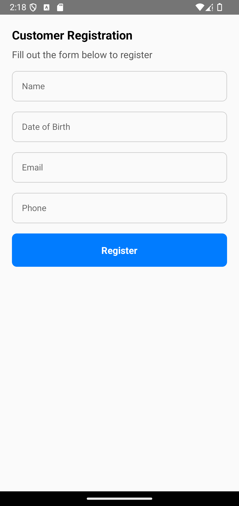

# 📝 **NewClient**

The **NewClient** component provides an intuitive interface for collecting customer registration details through customizable input fields.

---

## 📸 **Component Preview**

<table>
  <tr>
    <td><strong>NewClient</strong></td>
    <td></td>
  </tr>
</table>

---

## 🛠️ **Props**

| Prop       | Type                                     | Required | Description                                                                  |
| ---------- | ---------------------------------------- | -------- | ---------------------------------------------------------------------------- |
| `onSubmit` | `(data: Record<string, string>) => void` | ✅       | Callback function triggered when the form is submitted.                      |
| `fields`   | `string[]`                               | ✅       | Array of input field labels.                                                 |
| `title`    | `string`                                 | ✅       | Title text displayed at the top of the form.                                 |
| `subTitle` | `string`                                 | ❌       | Subtitle text displayed below the title.                                     |
| `styles`   | `object`                                 | ❌       | Custom styles for container, input, button, buttonText, title, and subTitle. |

---

## 💻 **Usage Example**

### 📝 **Basic Example**

```tsx
import React from "react";
import { View } from "react-native";
import { NewClient } from "react-native-ecommerce-components/lib";

const App = () => {
  const handleClientSubmission = (data) => {
    console.log("New Client Data:", data);
  };

  const fields = ["Name", "Date of Birth", "Email", "Phone"];

  return (
    <View>
      <NewClient
        onSubmit={handleClientSubmission}
        fields={fields}
        title="Customer Registration"
        subTitle="Fill out the form below to register"
      />
    </View>
  );
};

export default App;
```

---

## 🧪 **Testing**

Make sure to test the component after adding it to your project:

```sh
npx react-native run-android
```

or for iOS:

```sh
npx react-native run-ios
```

---

For more information or advanced customization, refer to the [main documentation](../../README.md).
