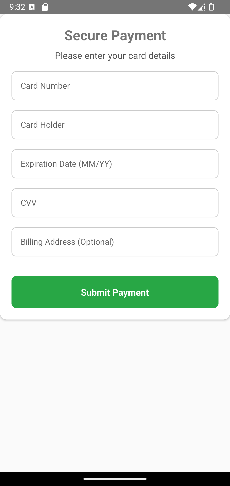

# 💳 **PaymentGateway**

The **PaymentGateway** component provides a secure and user-friendly interface for entering and submitting payment details.

---

## 📸 **Component Preview**

<table>
  <tr>
    <td><strong>PaymentGateway</strong></td>
    <td></td>
  </tr>
</table>

---

## 🛠️ **Props**

| Prop             | Type                                   | Required | Description                                              |
|-------------------|----------------------------------------|----------|----------------------------------------------------------|
| `onPaymentSubmit`| `(paymentDetails: PaymentDetails) => void` | ✅       | Callback triggered when payment details are submitted.  |
| `title`          | `string`                               | ✅       | Title text displayed at the top of the payment form.    |
| `subTitle`       | `string`                               | ❌       | Subtitle text displayed below the title.               |
| `styles`         | `object`                               | ❌       | Custom styles for `container`, `title`, `subTitle`, `input`, `button`, and `buttonText`. |

### 📦 **PaymentDetails Object Structure**

```ts
interface PaymentDetails {
  cardNumber: string;
  cardHolder: string;
  expirationDate: string;
  cvv: string;
  billingAddress?: string;
}
```

---

## 💻 **Usage Example**

### 📝 **Basic Example**

```tsx
import React from 'react';
import {View, Alert} from 'react-native';
import {PaymentGateway} from 'react-native-ecommerce-helper/lib';

const PaymentGatewayTest = () => {
  const handlePayment = paymentDetails => {
    console.log('Payment Details:', paymentDetails);
    Alert.alert('Payment Success', 'Payment details have been submitted.');
  };

  return (
    <View style={{flex: 1, justifyContent: 'center'}}>
      <PaymentGateway
        title="Secure Payment"
        subTitle="Please enter your card details"
        onPaymentSubmit={handlePayment}
      />
    </View>
  );
};

export default PaymentGatewayTest;
```

---

## 🧪 **Testing**

Make sure to test the component after adding it to your project:

```sh
npx react-native run-android
```

or for iOS:

```sh
npx react-native run-ios
```

---

For more information or advanced customization, refer to the [main documentation](../../README.md).
