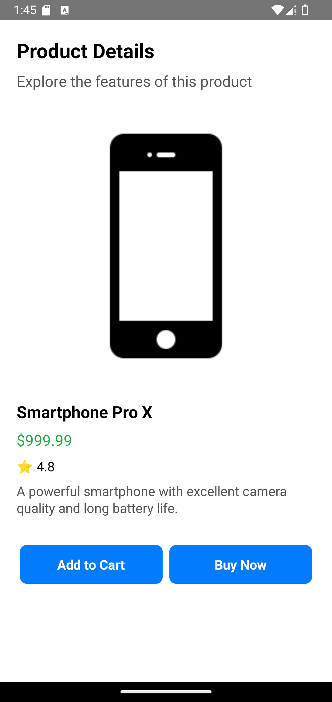

# 🛍️ **ProductDetail**

The **ProductDetail** component displays detailed information about a specific product, including its image, price, description, and purchase options.

---

## 📸 **Component Preview**

<table>
  <tr>
    <td><strong>ProductDetail</strong></td>
    <td></td>
  </tr>
</table>

---

## 🛠️ **Props**

| Prop            | Type                                  | Required | Description                                              |
|------------------|---------------------------------------|----------|----------------------------------------------------------|
| `product`       | `Product`                             | ✅       | Object containing product details.                      |
| `onAddToCart`   | `(product: Product) => void`          | ✅       | Callback triggered when 'Add to Cart' is pressed.        |
| `onBuyNow`      | `(product: Product) => void`          | ✅       | Callback triggered when 'Buy Now' is pressed.           |
| `title`         | `string`                              | ✅       | Title text displayed at the top of the product screen.  |
| `subTitle`      | `string`                              | ❌       | Subtitle text displayed below the title.               |
| `styles`        | `object`                              | ❌       | Custom styles for `container`, `image`, `title`, `subTitle`, `description`, `price`, `rating`, `buttonContainer`, `button`, and `buttonText`. |

### 📦 **Product Object Structure**

```ts
interface Product {
  id: string;
  title: string;
  description: string;
  price: number;
  image: string;
  rating?: number;
}
```

---

## 💻 **Usage Example**

### 📝 **Basic Example**

```tsx
import React from "react";
import { View, Alert } from "react-native";
import { ProductDetail } from "react-native-ecommerce-helper/lib";

const App = () => {
  const product = {
    id: "1",
    title: "Smartphone Pro X",
    description:
      "A powerful smartphone with excellent camera quality and long battery life.",
    price: 999.99,
    image:
      "https://cdn4.iconfinder.com/data/icons/ionicons/512/icon-iphone-256.png",
    rating: 4.8,
  };

  const handleAddToCart = (paramProduct) => {
    Alert.alert("Add to Cart", `${paramProduct.title} added to cart.`);
  };

  const handleBuyNow = (paramProduct) => {
    Alert.alert("Buy Now", `Proceeding to buy ${paramProduct.title}.`);
  };

  return (
    <View style={{ flex: 1 }}>
      <ProductDetail
        product={product}
        onAddToCart={handleAddToCart}
        onBuyNow={handleBuyNow}
        title="Product Details"
        subTitle="Explore the features of this product"
      />
    </View>
  );
};

export default App;
```

---

## 🧪 **Testing**

Make sure to test the component after adding it to your project:

```sh
npx react-native run-android
```

or for iOS:

```sh
npx react-native run-ios
```

---

For more information or advanced customization, refer to the [main documentation](../../README.md).
