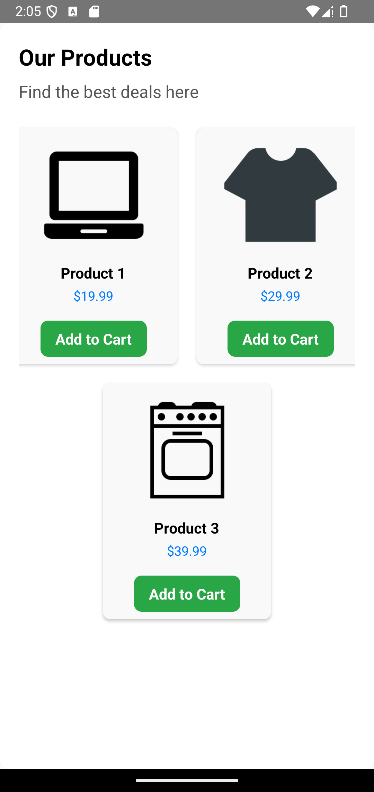

# 🛒 **ProductList**

The **ProductList** component displays a list of products in either grid or list view. It allows users to view product details, add items to the cart, and handle product selection actions.

---

## 📸 **Component Preview**

<table>
  <tr>
    <td><strong>ProductList</strong></td>
    <td></td>
  </tr>
</table>

---

## 🛠️ **Props**

| Prop             | Type                         | Required | Description                                                                                                                                         |
| ---------------- | ---------------------------- | -------- | --------------------------------------------------------------------------------------------------------------------------------------------------- |
| `products`       | `Product[]`                  | ✅       | Array of product objects to display.                                                                                                                |
| `onAddToCart`    | `(product: Product) => void` | ✅       | Callback triggered when 'Add to Cart' is pressed.                                                                                                   |
| `onProductPress` | `(product: Product) => void` | ✅       | Callback triggered when a product is selected.                                                                                                      |
| `gridView`       | `boolean`                    | ❌       | Enables grid layout if set to `true`. Defaults to `false`.                                                                                          |
| `title`          | `string`                     | ✅       | Title text displayed at the top of the list.                                                                                                        |
| `subTitle`       | `string`                     | ❌       | Subtitle text displayed below the title.                                                                                                            |
| `styles`         | `object`                     | ❌       | Custom styles for `container`, `productContainer`, `productImage`, `productTitle`, `productPrice`, `button`, `buttonText`, `title`, and `subTitle`. |
| `language`         | `en` ou `pt`                 | ❌          | Component language in Portuguese or English (default). |

### 📦 **Product Object Structure**

```ts
interface Product {
  id: string;
  title: string;
  price: number;
  image: string;
  rating?: number;
}
```

---

## 💻 **Usage Example**

### 📝 **Basic Example**

```tsx
import React from "react";
import { View, Alert } from "react-native";
import { ProductList } from "react-native-ecommerce-components/lib";

const App = () => {
  const products = [
    {
      id: "1",
      title: "Product 1",
      price: 19.99,
      image:
        "https://cdn3.iconfinder.com/data/icons/glypho-free/64/laptop-256.png",
    },
    {
      id: "2",
      title: "Product 2",
      price: 29.99,
      image:
        "https://cdn0.iconfinder.com/data/icons/news-and-magazine/512/fashion-256.png",
    },
    {
      id: "3",
      title: "Product 3",
      price: 39.99,
      image:
        "https://cdn2.iconfinder.com/data/icons/kitchen-appliances-computers-and-electronics/32/Appliances-15-256.png",
    },
  ];

  const handleAddToCart = (product) => {
    Alert.alert("Add to Cart", `${product.title} added to cart.`);
  };

  const handleProductPress = (product) => {
    Alert.alert("Product Selected", `You selected ${product.title}`);
  };

  return (
    <View style={{ flex: 1 }}>
      <ProductList
        products={products}
        onAddToCart={handleAddToCart}
        onProductPress={handleProductPress}
        gridView={true}
        title="Our Products"
        subTitle="Find the best deals here"
      />
    </View>
  );
};

export default App;
```

---

## 🧪 **Testing**

Make sure to test the component after adding it to your project:

```sh
npx react-native run-android
```

or for iOS:

```sh
npx react-native run-ios
```

---

For more information or advanced customization, refer to the [main documentation](../../README.md).
