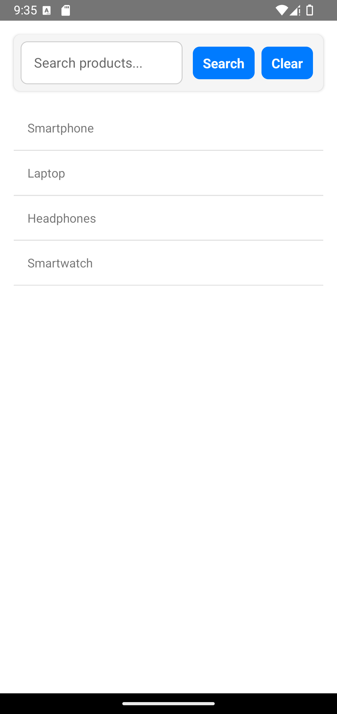

# 🔍 **SearchBar**

The **SearchBar** component provides an intuitive search interface, allowing users to filter content dynamically using a search query.

---

## 📸 **Component Preview**

<table>
  <tr>
    <td><strong>SearchBar</strong></td>
    <td></td>
  </tr>
</table>

---

## 🛠️ **Props**

| Prop              | Type                      | Required | Description                                                              |
| ----------------- | ------------------------- | -------- | ------------------------------------------------------------------------ |
| `onSearch`        | `(query: string) => void` | ✅       | Callback function triggered when the search is performed.                |
| `placeholder`     | `string`                  | ❌       | Placeholder text displayed in the input field. Default is `"Search..."`. |
| `clearButtonText` | `string`                  | ❌       | Text displayed on the clear button. Default is `"Clear"`.                |
| `styles`          | `object`                  | ❌       | Custom styles for `container`, `input`, `button`, and `buttonText`.      |
| `language`         | `en` ou `pt`                 | ❌          | Component language in Portuguese or English (default). |

---

## 💻 **Usage Example**

### 📝 **Basic Example**

```tsx
import React, { useState } from "react";
import { View, Text, FlatList, StyleSheet } from "react-native";
import { SearchBar } from "react-native-ecommerce-components/lib";

const App = () => {
  const [data, setData] = useState([
    { id: "1", name: "Smartphone" },
    { id: "2", name: "Laptop" },
    { id: "3", name: "Headphones" },
    { id: "4", name: "Smartwatch" },
  ]);

  const [filteredData, setFilteredData] = useState(data);

  const handleSearch = (query) => {
    if (query === "") {
      setFilteredData(data);
    } else {
      const filtered = data.filter((item) =>
        item.name.toLowerCase().includes(query.toLowerCase())
      );
      setFilteredData(filtered);
    }
  };

  return (
    <View style={styles.container}>
      <SearchBar onSearch={handleSearch} placeholder="Search products..." />
      <FlatList
        data={filteredData}
        keyExtractor={(item) => item.id}
        renderItem={({ item }) => (
          <View style={styles.item}>
            <Text>{item.name}</Text>
          </View>
        )}
      />
    </View>
  );
};

const styles = StyleSheet.create({
  container: {
    flex: 1,
    padding: 16,
    backgroundColor: "#fff",
  },
  item: {
    padding: 16,
    borderBottomWidth: 1,
    borderColor: "#ddd",
  },
});

export default App;
```

---

## 🧪 **Testing**

Make sure to test the component after adding it to your project:

```sh
npx react-native run-android
```

or for iOS:

```sh
npx react-native run-ios
```

---

For more information or advanced customization, refer to the [main documentation](../../README.md).
