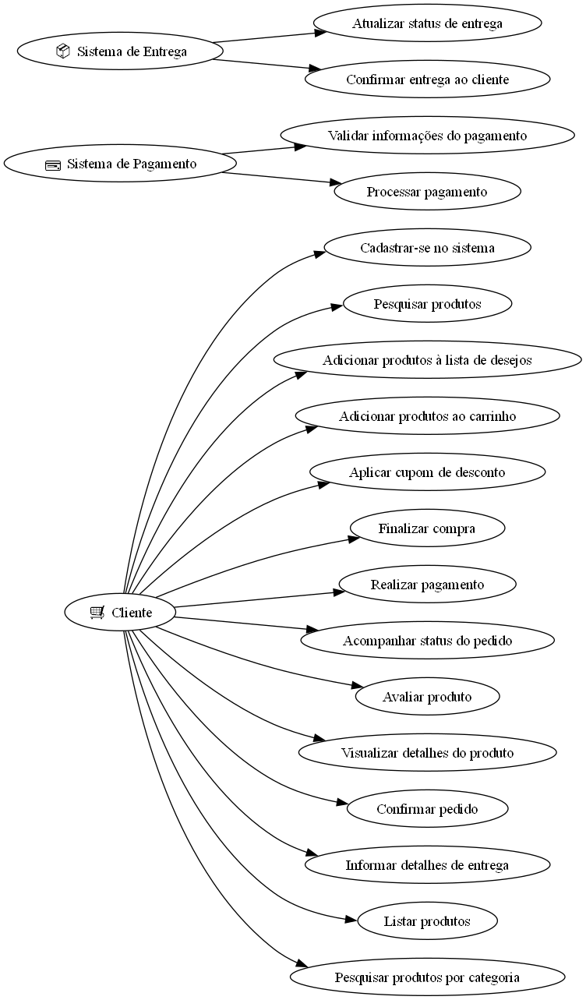
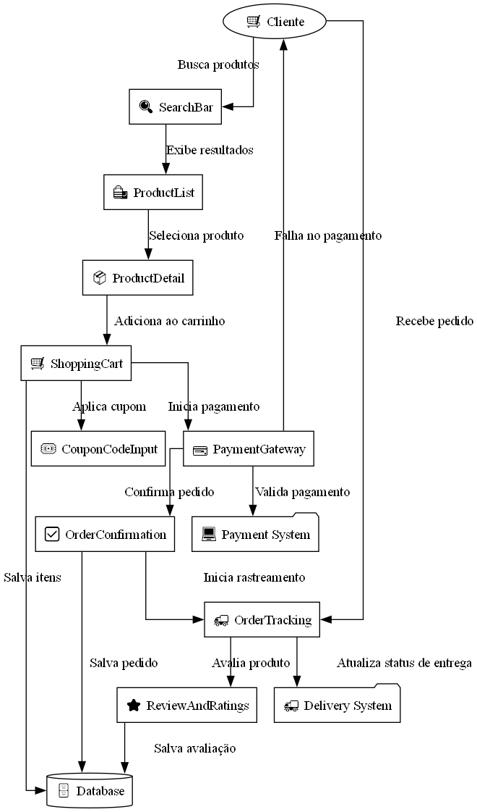
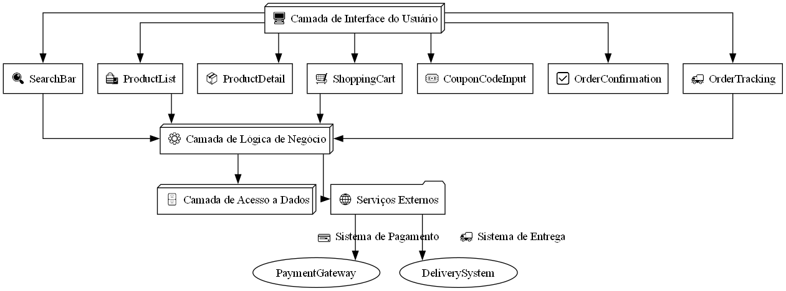

# 📊 **Diagramas do Projeto - react-native-ecommerce-helper**

Este documento apresenta e descreve os principais diagramas utilizados para representar a **estrutura** e o **funcionamento** da biblioteca **react-native-ecommerce-helper**. Esses diagramas têm como objetivo fornecer uma visão clara dos principais componentes, interações e fluxos de trabalho do sistema.

---

## 📝 **1. Diagrama de Casos de Uso**

### 📚 **Descrição:**
O **Diagrama de Casos de Uso** ilustra as interações entre **atores externos** (Cliente, Sistema de Pagamento e Sistema de Entrega) e as **funcionalidades principais** do sistema. Ele descreve os principais recursos disponíveis para cada ator.

### 🖼️ **Diagrama:**


### 📌 **Referência ao Código:**
O código Python usado para gerar este diagrama pode ser encontrado aqui:  
➡️ [Código do Diagrama de Casos de Uso](../Diagrams/UseCases/DiagramaDeCasosDeUso.py)

---

## 📝 **2. Diagrama de Componentes**

### 📚 **Descrição:**
O **Diagrama de Componentes** representa os principais módulos e bibliotecas do projeto. Ele exibe como cada componente está organizado e como eles se comunicam entre si.

### 🖼️ **Diagrama:**


### 📌 **Referência ao Código:**
O código Python usado para gerar este diagrama pode ser encontrado aqui:  
➡️ [Código do Diagrama de Componentes](../Diagrams/Components/DiagramaDeComponents.py)

---

## 📝 **3. Diagrama de Fluxo de Interação**

### 📚 **Descrição:**
O **Diagrama de Fluxo de Interação** ilustra como os principais componentes interagem durante um processo típico do sistema, como a finalização de uma compra ou a atualização do status de um pedido.

### 🖼️ **Diagrama:**


### 📌 **Referência ao Código:**
O código Python usado para gerar este diagrama pode ser encontrado aqui:  
➡️ [Código do Diagrama de Fluxo de Interação](../Diagrams/InteractionFlows/FluxoDeInteracoes.py)

---

## 📝 **4. Diagrama de Sequência**

### 📚 **Descrição:**
O **Diagrama de Sequência** descreve a ordem das interações entre os componentes do sistema durante um fluxo específico, como a busca de produtos ou o processamento de um pagamento.

### 🖼️ **Diagrama:**


### 📌 **Referência ao Código:**
O código Python usado para gerar este diagrama pode ser encontrado aqui:  
➡️ [Código do Diagrama de Sequência](../Diagrams/SequenceDiagram/DiagramaDeSequencia.py)

---

## 📝 **5. Diagrama de Arquitetura**

### 📚 **Descrição:**
O **Diagrama de Arquitetura** fornece uma visão geral das **camadas do sistema**. Ele detalha a **Camada de Interface do Usuário**, a **Camada de Lógica de Negócios**, a **Camada de Acesso a Dados** e como elas se conectam com os **Serviços Externos**.

### 🖼️ **Diagrama:**


### 📌 **Referência ao Código:**
O código Python usado para gerar este diagrama pode ser encontrado aqui:  
➡️ [Código do Diagrama de Arquitetura](../Diagrams/ArchitectureDiagram/DiagramaDeArquitetura.py)

---

## 🎯 **Importância dos Diagramas**

Os diagramas desempenham um papel crucial na compreensão, documentação e validação do sistema. Eles permitem que desenvolvedores, designers e partes interessadas compreendam os relacionamentos e responsabilidades dos componentes envolvidos no projeto.

- 🔍 **Clareza:** Auxiliam na compreensão da estrutura do sistema.  
- 🛠️ **Manutenção:** Facilitam atualizações e correções futuras.  
- 📑 **Documentação:** Servem como referência técnica para novas implementações.

---

## 💻 **Como Gerar os Diagramas**

1. Certifique-se de que os pacotes Python necessários estão instalados:
   ```bash
   pip install graphviz
   ```
2. Execute os scripts Python em seus respectivos diretórios:
   ```bash
   python DiagramaDeCasosDeUso.py
   python DiagramaDeComponents.py
   python FluxoDeInteracoes.py
   python DiagramaDeSequencia.py
   python DiagramaDeArquitetura.py
   ```
3. As imagens serão geradas automaticamente nos diretórios especificados.

---

Se precisar de ajustes nos diagramas ou desejar adicionar mais representações visuais, sinta-se à vontade para entrar em contato! 😊
