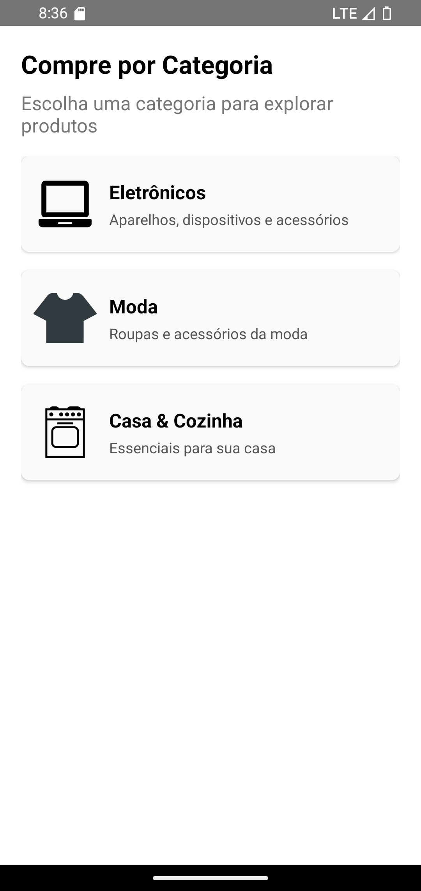

# 📚 **CategoryList**

O componente **CategoryList** exibe uma lista de categorias de produtos de forma organizada e personalizável.

---

## 📸 **Pré-visualização do Componente**

<table>
  <tr>
    <td><strong>Lista de categorias</strong></td>
    <td></td>
  </tr>
</table>

---

## 🛠️ **Propriedades (Props)**

| Propriedade        | Tipo                           | Obrigatória | Descrição                                                                                                                 |
| ------------------ | ------------------------------ | ----------- | ------------------------------------------------------------------------------------------------------------------------- |
| `categories`       | `Category[]`                   | ✅          | Array de objetos de categoria para exibição.                                                                              |
| `onSelectCategory` | `(category: Category) => void` | ✅          | Função de callback chamada quando uma categoria é selecionada.                                                            |
| `title`            | `string`                       | ✅          | Texto do título exibido no topo da lista.                                                                                 |
| `subTitle`         | `string`                       | ❌          | Texto do subtítulo exibido abaixo do título.                                                                              |
| `styles`           | `object`                       | ❌          | Estilos personalizados para container, categoryContainer, categoryImage, categoryText, descriptionText, title e subTitle. |
| `language`         | `en` ou `pt`                 | ❌          | Linguagem do componente em português ou inglês (default). |

### 📦 **Estrutura do Objeto Category**

```ts
interface Category {
  id: string;
  name: string;
  image?: string;
  description?: string;
}
```

---

## 💻 **Exemplo de Uso**

### 📝 **Exemplo Básico**

```tsx
import React from 'react';
import {View, Alert} from 'react-native';
import {CategoryList} from 'react-native-ecommerce-components/lib';

const App = () => {
  const categories = [
    {
      id: '1',
      name: 'Eletrônicos',
      image:
        'https://cdn3.iconfinder.com/data/icons/glypho-free/64/laptop-256.png',
      description: 'Aparelhos, dispositivos e acessórios',
    },
    {
      id: '2',
      name: 'Moda',
      image:
        'https://cdn0.iconfinder.com/data/icons/news-and-magazine/512/fashion-256.png',
      description: 'Roupas e acessórios da moda',
    },
    {
      id: '3',
      name: 'Casa & Cozinha',
      image:
        'https://cdn2.iconfinder.com/data/icons/kitchen-appliances-computers-and-electronics/32/Appliances-15-256.png',
      description: 'Essenciais para sua casa',
    },
  ];

  const handleCategorySelect = category => {
    Alert.alert('Categoria Selecionada', `Você selecionou: ${category.name}`);
  };

  return (
    <View style={{flex: 1}}>
      <CategoryList
        categories={categories}
        onSelectCategory={handleCategorySelect}
        title="Compre por Categoria"
        subTitle="Escolha uma categoria para explorar produtos"
      />
    </View>
  );
};

export default App;
```

---

## 🧪 **Testando o Componente**

Certifique-se de testar o componente após adicioná-lo ao seu projeto:

```sh
npx react-native run-android
```

ou para iOS:

```sh
npx react-native run-ios
```

---

Para mais informações ou personalizações avançadas, consulte a [documentação principal](../../README.md).
