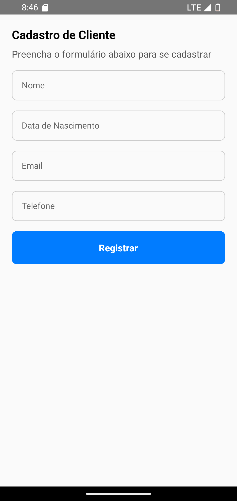

# 📝 **NewClient**

O componente **NewClient** fornece uma interface intuitiva para coletar informações de cadastro de clientes por meio de campos de entrada personalizáveis.

---

## 📸 **Pré-visualização do Componente**

<table>
  <tr>
    <td><strong>Novo Cliente</strong></td>
    <td></td>
  </tr>
</table>

---

## 🛠️ **Propriedades (Props)**

| Propriedade | Tipo                                     | Obrigatória | Descrição                                                                           |
| ----------- | ---------------------------------------- | ----------- | ----------------------------------------------------------------------------------- |
| `onSubmit`  | `(data: Record<string, string>) => void` | ✅          | Função de callback acionada quando o formulário é enviado.                          |
| `fields`    | `string[]`                               | ✅          | Array com os rótulos dos campos de entrada.                                         |
| `title`     | `string`                                 | ✅          | Texto do título exibido no topo do formulário.                                      |
| `subTitle`  | `string`                                 | ❌          | Texto do subtítulo exibido abaixo do título.                                        |
| `styles`    | `object`                                 | ❌          | Estilos personalizados para container, input, button, buttonText, title e subTitle. |
| `language`         | `en` ou `pt`                 | ❌          | Linguagem do componente em português ou inglês (default). |

---

## 💻 **Exemplo de Uso**

### 📝 **Exemplo Básico**

```tsx
import React from "react";
import { View } from "react-native";
import { NewClient } from "react-native-ecommerce-components/lib";

const App = () => {
  const handleClientSubmission = (data) => {
    console.log("Dados do Novo Cliente:", data);
  };

  const fields = ["Nome", "Data de Nascimento", "Email", "Telefone"];

  return (
    <View>
      <NewClient
        language="pt"
        onSubmit={handleClientSubmission}
        fields={fields}
        title="Cadastro de Cliente"
        subTitle="Preencha o formulário abaixo para se cadastrar"
      />
    </View>
  );
};

export default App;
```

---

## 🧪 **Testando o Componente**

Certifique-se de testar o componente após adicioná-lo ao seu projeto:

```sh
npx react-native run-android
```

ou para iOS:

```sh
npx react-native run-ios
```

---

Para mais informações ou personalizações avançadas, consulte a [documentação principal](../../README.md).
