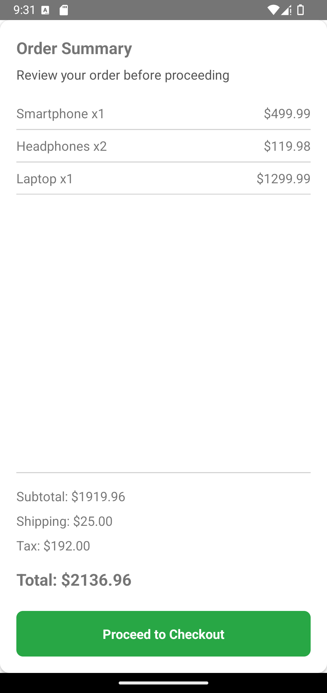

# 📦 **OrderSummary**

O componente **OrderSummary** fornece um resumo detalhado de um pedido, incluindo custos detalhados, totais e um botão acionável para finalizar a compra.

---

## 📸 **Pré-visualização do Componente**

<table>
  <tr>
    <td><strong>Resumo do Pedido</strong></td>
    <td></td>
  </tr>
</table>

---

## 🛠️ **Propriedades (Props)**

| Propriedade  | Tipo          | Obrigatória | Descrição                                                                                                                                                           |
| ------------ | ------------- | ----------- | ------------------------------------------------------------------------------------------------------------------------------------------------------------------- |
| `items`      | `OrderItem[]` | ✅          | Array de itens do pedido com `id`, `name`, `price` e `quantity`.                                                                                                    |
| `subtotal`   | `number`      | ✅          | Valor subtotal do pedido.                                                                                                                                           |
| `shipping`   | `number`      | ✅          | Custo de envio do pedido.                                                                                                                                           |
| `tax`        | `number`      | ✅          | Valor do imposto aplicado ao pedido.                                                                                                                                |
| `total`      | `number`      | ✅          | Valor total do pedido (subtotal + envio + impostos).                                                                                                                |
| `onCheckout` | `() => void`  | ✅          | Função de callback acionada ao pressionar o botão de finalização.                                                                                                   |
| `title`      | `string`      | ✅          | Texto do título exibido no topo do resumo.                                                                                                                          |
| `subTitle`   | `string`      | ❌          | Texto do subtítulo exibido abaixo do título.                                                                                                                        |
| `styles`     | `object`      | ❌          | Estilos personalizados para `container`, `itemContainer`, `itemText`, `summaryContainer`, `summaryText`, `totalText`, `button`, `buttonText`, `title` e `subTitle`. |

### 📦 **Estrutura do Objeto OrderItem**

```ts
interface OrderItem {
  id: string;
  name: string;
  price: number;
  quantity: number;
}
```

---

## 💻 **Exemplo de Uso**

### 📝 **Exemplo Básico**

```tsx
import React from "react";
import { View, Alert, StyleSheet } from "react-native";
import { OrderSummary } from "react-native-ecommerce-components/lib";

const App = () => {
  const orderItems = [
    { id: "1", name: "Smartphone", price: 499.99, quantity: 1 },
    { id: "2", name: "Headphones", price: 59.99, quantity: 2 },
    { id: "3", name: "Laptop", price: 1299.99, quantity: 1 },
  ];

  const subtotal = orderItems.reduce(
    (sum, item) => sum + item.price * item.quantity,
    0
  );
  const shipping = 25.0;
  const tax = subtotal * 0.1;
  const total = subtotal + shipping + tax;

  const handleCheckout = () => {
    Alert.alert(
      "Checkout",
      `Your order total is $${total.toFixed(2)}. Proceeding to payment...`
    );
  };

  return (
    <View style={styles.container}>
      <OrderSummary
        items={orderItems}
        subtotal={subtotal}
        shipping={shipping}
        tax={tax}
        total={total}
        onCheckout={handleCheckout}
        title="Order Summary"
        subTitle="Review your order before proceeding"
      />
    </View>
  );
};

const styles = StyleSheet.create({
  container: {
    flex: 1,
    backgroundColor: "#fff",
  },
});

export default App;
```

---

## 🧪 **Testando o Componente**

Certifique-se de testar o componente após adicioná-lo ao seu projeto:

```sh
npx react-native run-android
```

ou para iOS:

```sh
npx react-native run-ios
```

---

Para mais informações ou personalizações avançadas, consulte a [documentação principal](../../README.md).
