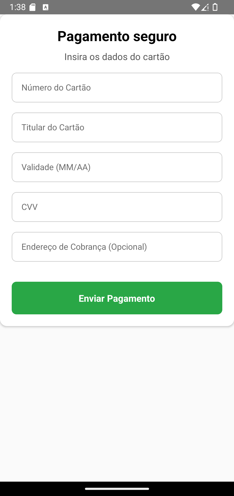

# 💳 **PaymentGateway**

O componente **PaymentGateway** fornece uma interface segura e intuitiva para inserir e enviar detalhes de pagamento.

---

## 📸 **Pré-visualização do Componente**

<table>
  <tr>
    <td><strong>Gateway de Pagamento</strong></td>
    <td></td>
  </tr>
</table>

---

## 🛠️ **Propriedades (Props)**

| Propriedade       | Tipo                                       | Obrigatória | Descrição                                                                                       |
| ----------------- | ------------------------------------------ | ----------- | ----------------------------------------------------------------------------------------------- |
| `onPaymentSubmit` | `(paymentDetails: PaymentDetails) => void` | ✅          | Callback acionado quando os detalhes de pagamento são enviados.                                 |
| `title`           | `string`                                   | ✅          | Texto do título exibido no topo do formulário de pagamento.                                     |
| `subTitle`        | `string`                                   | ❌          | Texto do subtítulo exibido abaixo do título.                                                    |
| `styles`          | `object`                                   | ❌          | Estilos personalizados para `container`, `title`, `subTitle`, `input`, `button` e `buttonText`. |
| `language`         | `en` ou `pt`                 | ❌          | Linguagem do componente em português ou inglês (default). |

### 📦 **Estrutura do Objeto PaymentDetails**

```ts
interface PaymentDetails {
  cardNumber: string;
  cardHolder: string;
  expirationDate: string;
  cvv: string;
  billingAddress?: string;
}
```

---

## 💻 **Exemplo de Uso**

### 📝 **Exemplo Básico**

```tsx
import React from "react";
import { View, Alert } from "react-native";
import { PaymentGateway } from "react-native-ecommerce-components/lib";

const PaymentGatewayTest = () => {
  const handlePayment = (paymentDetails) => {
    console.log("Detalhes do pagamento:", paymentDetails);
    Alert.alert("Pagamento realizado", "Os detalhes do pagamento foram enviados.");
  };

  return (
    <View style={{ flex: 1, justifyContent: "center" }}>
      <PaymentGateway
        title="Pagamento seguro"
        subTitle="Insira os dados do cartão"
        onPaymentSubmit={handlePayment}
      />
    </View>
  );
};

export default PaymentGatewayTest;
```

---

## 🧪 **Testando o Componente**

Certifique-se de testar o componente após adicioná-lo ao seu projeto:

```sh
npx react-native run-android
```

ou para iOS:

```sh
npx react-native run-ios
```

---

Para mais informações ou personalizações avançadas, consulte a [documentação principal](../../README.md).
