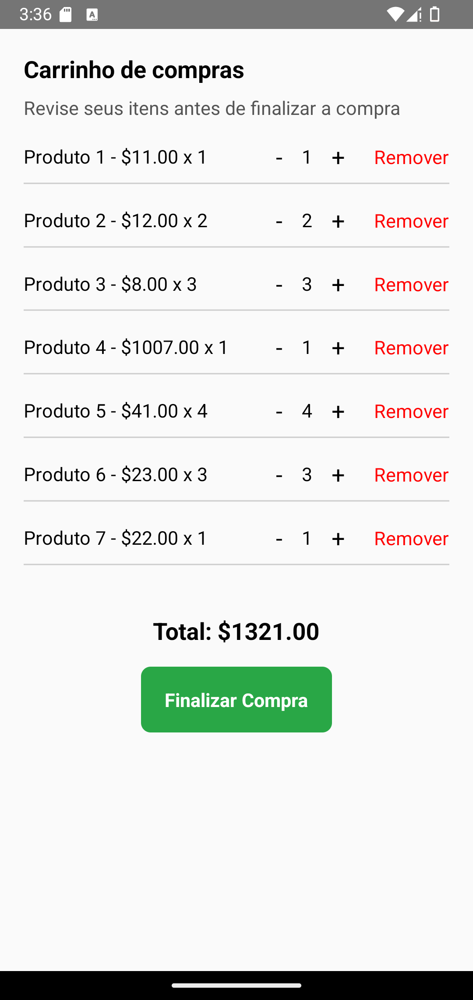

# 🛒 **Carrinho de Compras**

O componente **ShoppingCart** fornece uma visão detalhada dos itens no carrinho de um usuário, permitindo atualizar quantidades, remover itens e prosseguir para o checkout.

---

## 📸 **Pré-visualização do Componente**

<table>
  <tr>
    <td><strong>Carrinho de Compras</strong></td>
    <td></td>
  </tr>
</table>

---

## 🛠️ **Propriedades (Props)**

| Propriedade        | Tipo                                         | Obrigatória | Descrição                                                                                                                                          |
| ------------------ | -------------------------------------------- | ----------- | -------------------------------------------------------------------------------------------------------------------------------------------------- |
| `items`            | `CartItem[]`                                 | ✅          | Array de itens no carrinho com `id`, `name`, `price` e `quantity`.                                                                                 |
| `onUpdateQuantity` | `(id: string, quantity: number) => void`     | ✅          | Callback para atualizar a quantidade de um item no carrinho.                                                                                       |
| `onRemoveItem`     | `(id: string) => void`                       | ✅          | Callback para remover um item do carrinho.                                                                                                         |
| `onCheckout`       | `(items: CartItem[], total: number) => void` | ✅          | Callback acionado quando o botão de checkout é pressionado.                                                                                        |
| `title`            | `string`                                     | ✅          | Texto do título exibido no topo do carrinho.                                                                                                       |
| `subTitle`         | `string`                                     | ❌          | Texto do subtítulo exibido abaixo do título.                                                                                                       |
| `styles`           | `object`                                     | ❌          | Estilos personalizados para `container`, `itemContainer`, `itemText`, `button`, `buttonText`, `totalContainer`, `totalText`, `title` e `subTitle`. |
| `language`         | `en` ou `pt`                 | ❌          | Linguagem do componente em português ou inglês (default). |

---

### 📦 **Estrutura do Objeto CartItem**

```ts
interface CartItem {
  id: string;
  name: string;
  price: number;
  quantity: number;
}
```

---

## 💻 **Exemplo de Uso**

### 📝 **Exemplo Básico**

```tsx
import React, { useState } from "react";
import { View, Alert } from "react-native";
import { ShoppingCart } from "react-native-ecommerce-components/lib";

const ShoppingCartTest = () => {
  const [items, setItems] = useState([
    { id: "1", name: "Produto 1", price: 10.99, quantity: 1 },
    { id: "2", name: "Produto 2", price: 15.49, quantity: 2 },
    { id: "3", name: "Produto 3", price: 7.99, quantity: 3 },
    { id: "4", name: "Produto 4", price: 1007, quantity: 1 },
    { id: "5", name: "Produto 5", price: 37.99, quantity: 4 },
    { id: "6", name: "Produto 6", price: 22.99, quantity: 3 },
    { id: "7", name: "Produto 7", price: 70.15, quantity: 1 },
  ]);

  const handleUpdateQuantity = (id, quantity) => {
    setItems((prevItems) =>
      prevItems.map((item) => (item.id === id ? { ...item, quantity } : item))
    );
  };

  const handleRemoveItem = (id) => {
    setItems((prevItems) => prevItems.filter((item) => item.id !== id));
  };

  const handleCheckout = (cartItems, total) => {
    Alert.alert("Checkout", `Total: $${total.toFixed(2)}`);
  };

  return (
    <View style={{ flex: 1, padding: 20 }}>
      <ShoppingCart
        items={items}
        onUpdateQuantity={handleUpdateQuantity}
        onRemoveItem={handleRemoveItem}
        onCheckout={handleCheckout}
        title="Carrinho de Compras"
        subTitle="Revise seus itens abaixo"
      />
    </View>
  );
};

export default ShoppingCartTest;
```

---

## 🧪 **Testando o Componente**

Certifique-se de testar o componente após adicioná-lo ao seu projeto:

```sh
npx react-native run-android
```

ou para iOS:

```sh
npx react-native run-ios
```

---

Para mais informações ou personalizações avançadas, consulte a [documentação principal](../../README.md).
