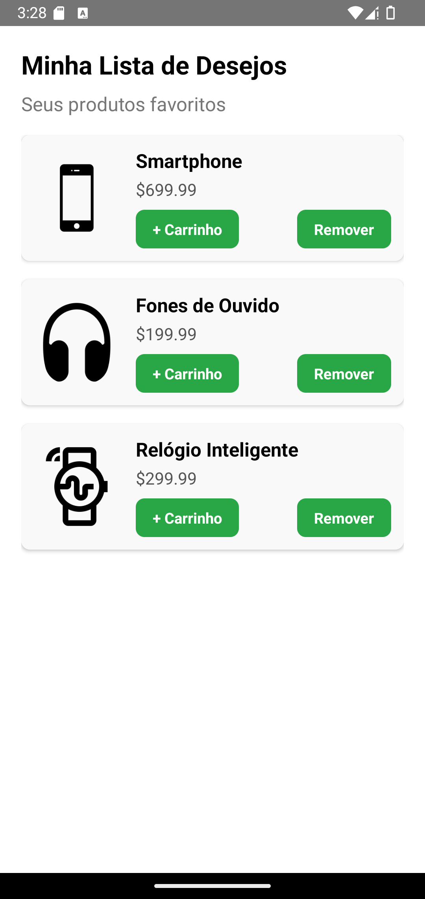

# ❤️ **Lista de Desejos**

O componente **WishList** exibe uma lista de produtos favoritos, permitindo que os usuários adicionem itens ao carrinho ou os removam da lista de desejos.

---

## 📸 **Pré-visualização do Componente**

<table>
  <tr>
    <td><strong>Lista de Desejos</strong></td>
    <td></td>
  </tr>
</table>

---

## 🛠️ **Propriedades (Props)**

| Propriedade    | Tipo                           | Obrigatória | Descrição                                                                                                                                                    |
| -------------- | ------------------------------ | ----------- | ------------------------------------------------------------------------------------------------------------------------------------------------------------ |
| `items`        | `WishlistItem[]`               | ✅          | Array de itens na lista de desejos com `id`, `name`, `price` e `image`.                                                                                      |
| `onRemoveItem` | `(id: string) => void`         | ✅          | Callback acionado quando um item é removido da lista de desejos.                                                                                             |
| `onAddToCart`  | `(item: WishlistItem) => void` | ✅          | Callback acionado quando um item é adicionado ao carrinho.                                                                                                   |
| `title`        | `string`                       | ✅          | Texto do título exibido no topo da lista de desejos.                                                                                                         |
| `subTitle`     | `string`                       | ❌          | Texto do subtítulo exibido abaixo do título.                                                                                                                 |
| `styles`       | `object`                       | ❌          | Estilos personalizados para `container`, `itemContainer`, `image`, `itemText`, `priceText`, `buttonContainer`, `button`, `buttonText`, `title` e `subTitle`. |
| `language`         | `en` ou `pt`                 | ❌          | Linguagem do componente em português ou inglês (default). |
---

### 📦 **Estrutura do Objeto WishlistItem**

```ts
interface WishlistItem {
  id: string;
  name: string;
  price: number;
  image: string;
}
```

---

## 💻 **Exemplo de Uso**

### 📝 **Exemplo Básico**

```ts
import React from "react";
import { View, Alert } from "react-native";
import { WishList } from "react-native-ecommerce-components/lib";

const App = () => {
  const wishlistItems = [
    {
      id: "1",
      name: "Smartphone",
      price: 699.99,
      image:
        "https://cdn4.iconfinder.com/data/icons/ionicons/512/icon-iphone-256.png",
    },
    {
      id: "2",
      name: "Fones de Ouvido",
      price: 199.99,
      image:
        "https://cdn4.iconfinder.com/data/icons/ionicons/512/icon-headphone-256.png",
    },
    {
      id: "3",
      name: "Relógio Inteligente",
      price: 299.99,
      image:
        "https://cdn2.iconfinder.com/data/icons/technology-straight-line/128/SVG_LINE_TECHNOLOGY-03-256.png",
    },
  ];

  const handleRemoveItem = (id) => {
    Alert.alert("Removido", `Item com ID: ${id} removido da lista de desejos`);
  };

  const handleAddToCart = (item) => {
    Alert.alert("Adicionado ao Carrinho", `${item.name} adicionado ao carrinho`);
  };

  return (
    <View style={{ flex: 1 }}>
      <WishList
        language="pt"
        items={wishlistItems}
        onRemoveItem={handleRemoveItem}
        onAddToCart={handleAddToCart}
        title="Minha Lista de Desejos"
        subTitle="Seus produtos favoritos"
      />
    </View>
  );
};

export default App;
```

---

## 🧪 **Testando o Componente**

Certifique-se de testar o componente após adicioná-lo ao seu projeto:

```sh
npx react-native run-android
```

ou para iOS:

```sh
npx react-native run-ios
```

---

Para mais informações ou personalizações avançadas, consulte a [documentação principal](../../README.md).
