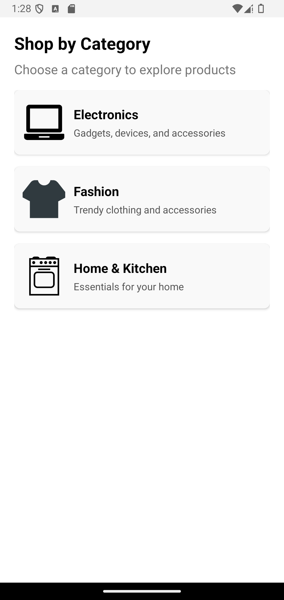
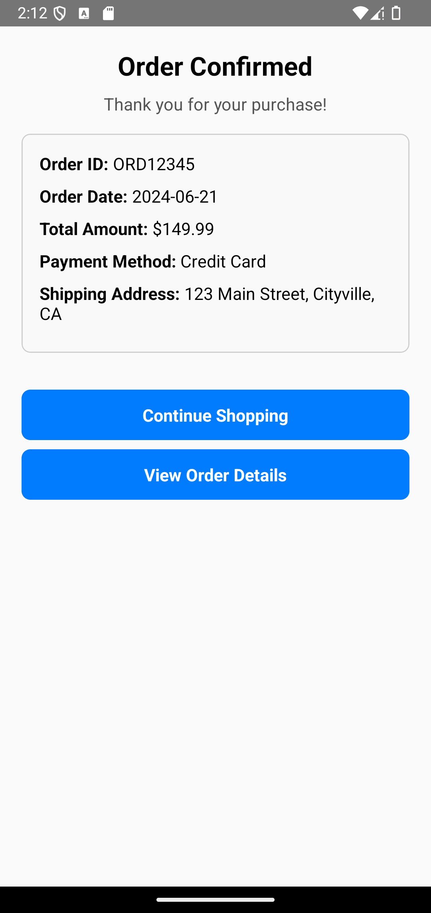
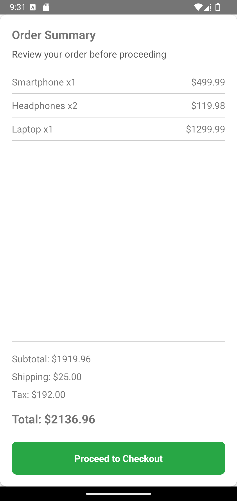
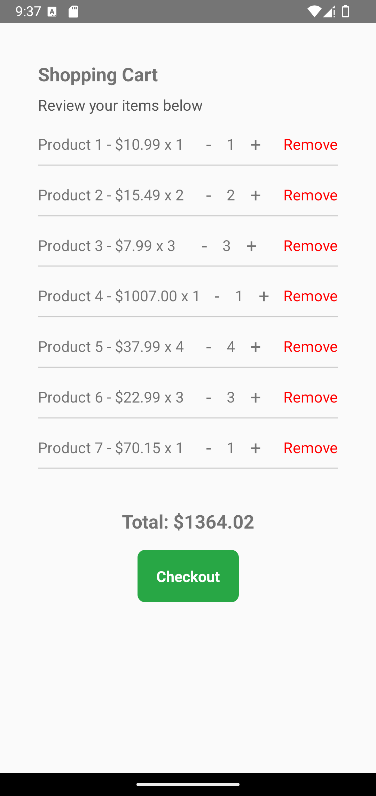
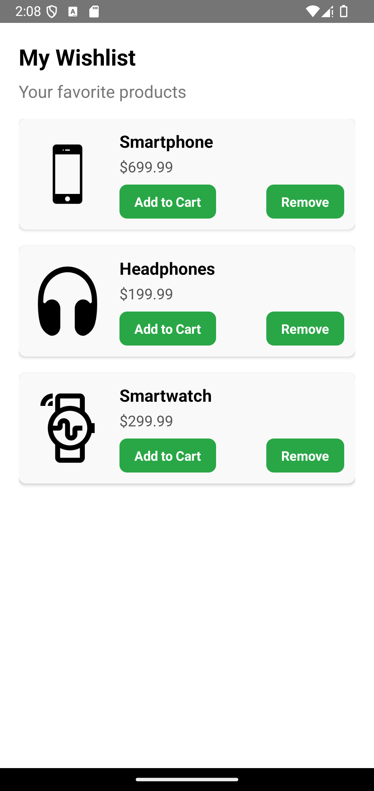

<p align="center">
  <a href="./README.md">🇺🇸 English Documentation</a> | 
  <a href="./README-pt.md">🇧🇷 Documentação em Português</a>
</p>

---

<h1 align="center">
  react-native-ecommerce-helper
</h1>

<h5 align="center">
  Componentes para acelerar o desenvolvimento do seu ecommerce.
</h5>

---

<p align="center">
  

  <a href="https://img.shields.io/github/repo-size/Danilo-Js/react-native-ecommerce-helper/commits/master">
    
  </a>
  
  
  
  
</p>

<p align="center">
  <a href="https://img.shields.io/github/issues/Danilo-Js/react-native-ecommerce-helper/issues">
    
  </a>

  

  <a href="https://www.npmjs.com/package/react-native-ecommerce-helper">
    
  </a>
</p>

<p align="center">
  <a href="#information_source-sobre-o-projeto">Sobre o projeto</a>&nbsp;&nbsp;&nbsp;|&nbsp;&nbsp;&nbsp;
  <a href="#clipboard-uso">Uso</a>&nbsp;&nbsp;&nbsp;|&nbsp;&nbsp;&nbsp;
  <a href="#memo-licença">Licença</a>&nbsp;&nbsp;&nbsp;|&nbsp;&nbsp;&nbsp;
  <a href="Docs/Portuguese/HowToContribuite.md">Como contribuir</a>&nbsp;&nbsp;&nbsp;|&nbsp;&nbsp;&nbsp;
  <a href="Docs/Portuguese/Diagrams.md">Diagramas</a>&nbsp;&nbsp;&nbsp;
</p>

---

## 📸 **Componentes**

Clique na imagem para visualizar a documentação do componente.

<table>
  <tr>
    <td align="center">
      <a href="Docs/Portuguese/Usage/CategoryList.md">
        <strong>Lista de Categorias</strong><br/>
        
      </a>
    </td>
    <td align="center">
      <a href="Docs/Portuguese/Usage/CouponCodeInput.md">
        <strong>Entrada de Cupom</strong><br/>
        
      </a>
    </td>
    <td align="center">
      <a href="Docs/Portuguese/Usage/NewClient.md">
        <strong>Formulário Novo Cliente</strong><br/>
        
      </a>
    </td>
    <td align="center">
      <a href="Docs/Portuguese/Usage/OrderConfirmation.md">
        <strong>Confirmação de Pedido</strong><br/>
        
      </a>
    </td>
  </tr>
  <tr>
    <td align="center">
      <a href="Docs/Portuguese/Usage/OrderSummary.md">
        <strong>Resumo do Pedido</strong><br/>
        
      </a>
    </td>
    <td align="center">
      <a href="Docs/Portuguese/Usage/OrderTracking.md">
        <strong>Rastreamento de Pedido</strong><br/>
        
      </a>
    </td>
    <td align="center">
      <a href="Docs/Portuguese/Usage/PaymentGateway.md">
        <strong>Gateway de Pagamento</strong><br/>
        
      </a>
    </td>
    <td align="center">
      <a href="Docs/Portuguese/Usage/ProductDetail.md">
        <strong>Detalhes do Produto</strong><br/>
        
      </a>
    </td>
  </tr>
  <tr>
    <td align="center">
      <a href="Docs/Portuguese/Usage/ProductList.md">
        <strong>Lista de Produtos</strong><br/>
        
      </a>
    </td>
    <td align="center">
      <a href="Docs/Portuguese/Usage/ReviewAndRatings.md">
        <strong>Avaliações</strong><br/>
        
      </a>
    </td>
    <td align="center">
      <a href="Docs/Portuguese/Usage/SearchBar.md">
        <strong>Barra de Pesquisa</strong><br/>
        
      </a>
    </td>
    <td align="center">
      <a href="Docs/Portuguese/Usage/ShippingDetails.md">
        <strong>Detalhes de Envio</strong><br/>
        
      </a>
    </td>
  </tr>
  <tr>
    <td align="center">
      <a href="Docs/Portuguese/Usage/ShoppingCart.md">
        <strong>Carrinho de Compras</strong><br/>
        
      </a>
    </td>
    <td align="center">
      <a href="Docs/Portuguese/Usage/WishList.md">
        <strong>Lista de Desejos</strong><br/>
        
      </a>
    </td>
  </tr>
</table>

---

## :information_source: **Sobre o Projeto**

Este projeto foi criado como parte de um **Trabalho de Conclusão de Curso (TCC)** em Ciência da Computação na **UFES (Universidade Federal do Espírito Santo)**.

Deixe uma ***⭐ ESTRELA*** no [repositório](https://github.com/Danilo-Js/react-native-ecommerce-helper) e contribua para melhorar ainda mais esta biblioteca.

---

## :clipboard: **Uso**

### **Instalação**

```sh
yarn add react-native-ecommerce-helper
```

ou

```sh
npm install react-native-ecommerce-helper
```

## :memo: **Licença**

Este projeto está sob a **Licença MIT**. Consulte o arquivo [LICENSE](https://github.com/Danilo-Js/react-native-ecommerce-helper/blob/master/LICENSE) para mais detalhes.

---

**Feito com ❤️ por Danilo José Lima de Oliveira**  
[Entre em contato!](https://www.linkedin.com/in/danilo-js/)
