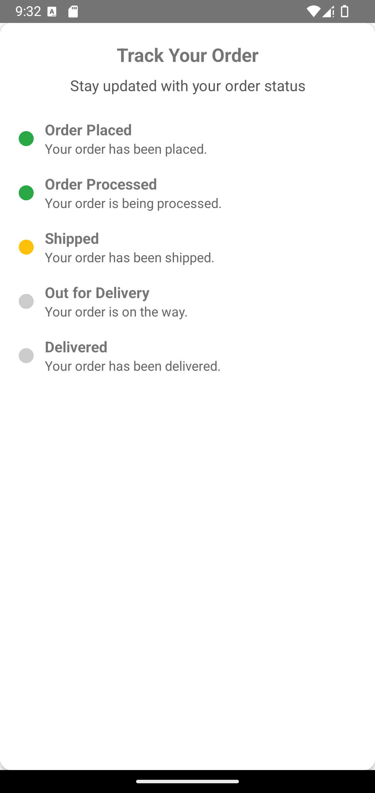
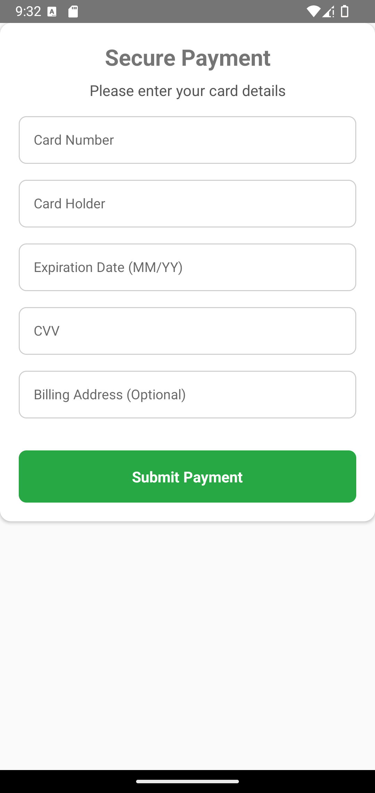
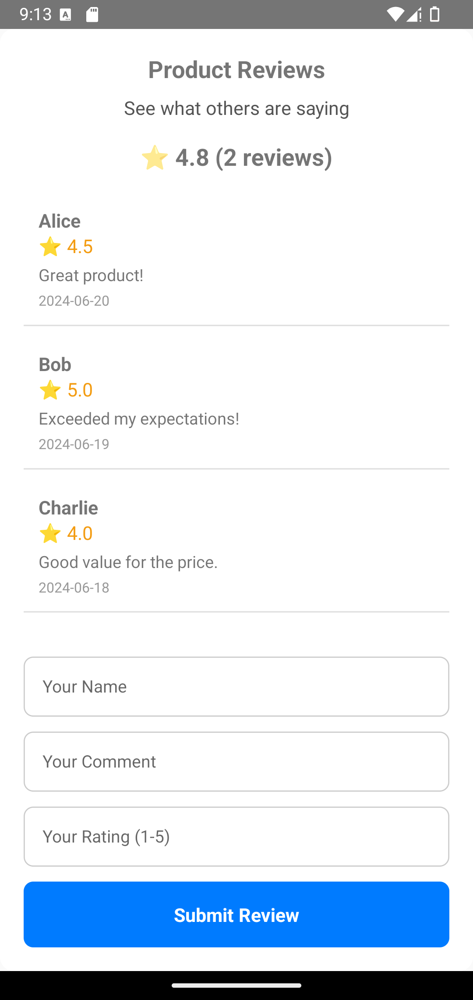

<h1 align="center">
  react-native-ecommerce-helper
</h1>

<h5 align="center">
  Components to boost the development of your ecommerce.
</h5>

</br>

<p align="center">
  

  <a href="https://img.shields.io/github/repo-size/Danilo-Js/react-native-ecommerce-helper/commits/master">
    
  </a>
  
  
  
  
</p>

<p align="center">
  <a href="https://img.shields.io/github/issues/Danilo-Js/react-native-ecommerce-helper/issues">
    
  </a>

  

  <a href="https://www.npmjs.com/package/react-native-react-native-search-bar">
    
  </a>
</p>

<p align="center">
  <a href="#information_source-about-the-project">About the project</a>&nbsp;&nbsp;&nbsp;|&nbsp;&nbsp;&nbsp;
  <a href="#clipboard-usage">Usage</a>&nbsp;&nbsp;&nbsp;|&nbsp;&nbsp;&nbsp;
  <a href="Docs/HowToContribuite.md">How to contribute</a>&nbsp;&nbsp;&nbsp;|&nbsp;&nbsp;&nbsp;
  <a href="#memo-license">License</a>
</p>

---

## 📸 **Components**

<div style="
  display: flex; 
  flex-wrap: wrap; 
  gap: 20px; 
  justify-content: center; 
  align-items: flex-start;
  max-width: 100%;
">

  <div style="text-align: center; width: 200px;">
    <a href="Docs/CategoryList.md" style="text-decoration: underline; color: blue;">
      <strong>CategoryList</strong>
    </a><br/>
    
  </div>

  <div style="text-align: center; width: 200px;">
    <a href="Docs/CouponCodeInput.md" style="text-decoration: underline; color: blue;">
      <strong>CouponCodeInput</strong>
    </a><br/>
    
  </div>

  <div style="text-align: center; width: 200px;">
    <a href="Docs/NewClient.md" style="text-decoration: underline; color: blue;">
      <strong>NewClient</strong>
    </a><br/>
    
  </div>

  <div style="text-align: center; width: 200px;">
    <a href="Docs/OrderConfirmation.md" style="text-decoration: underline; color: blue;">
      <strong>OrderConfirmation</strong>
    </a><br/>
    
  </div>

  <div style="text-align: center; width: 200px;">
    <a href="Docs/OrderSummary.md" style="text-decoration: underline; color: blue;">
      <strong>OrderSummary</strong>
    </a><br/>
    
  </div>

  <div style="text-align: center; width: 200px;">
    <a href="Docs/OrderTracking.md" style="text-decoration: underline; color: blue;">
      <strong>OrderTracking</strong>
    </a><br/>
    
  </div>

  <div style="text-align: center; width: 200px;">
    <a href="Docs/PaymentGateway.md" style="text-decoration: underline; color: blue;">
      <strong>PaymentGateway</strong>
    </a><br/>
    
  </div>

  <div style="text-align: center; width: 200px;">
    <a href="Docs/ProductDetail.md" style="text-decoration: underline; color: blue;">
      <strong>ProductDetail</strong>
    </a><br/>
    
  </div>

  <div style="text-align: center; width: 200px;">
    <a href="Docs/ProductList.md" style="text-decoration: underline; color: blue;">
      <strong>ProductList</strong>
    </a><br/>
    
  </div>

  <div style="text-align: center; width: 200px;">
    <a href="Docs/ReviewAndRatings.md" style="text-decoration: underline; color: blue;">
      <strong>ReviewAndRatings</strong>
    </a><br/>
    
  </div>

  <div style="text-align: center; width: 200px;">
    <a href="Docs/SearchBar.md" style="text-decoration: underline; color: blue;">
      <strong>SearchBar</strong>
    </a><br/>
    
  </div>

  <div style="text-align: center; width: 200px;">
    <a href="Docs/ShippingDetails.md" style="text-decoration: underline; color: blue;">
      <strong>ShippingDetails</strong>
    </a><br/>
    
  </div>

  <div style="text-align: center; width: 200px;">
    <a href="Docs/ShoppingCart.md" style="text-decoration: underline; color: blue;">
      <strong>ShoppingCart</strong>
    </a><br/>
    
  </div>

  <div style="text-align: center; width: 200px;">
    <a href="Docs/WishList.md" style="text-decoration: underline; color: blue;">
      <strong>WishList</strong>
    </a><br/>
    
  </div>
</div>

---

## :information_source: **About the Project**

This project was created as part of a final paper for the Computer Science course at **UFES (Federal University of Espírito Santo)**.  

Please leave a ***⭐ STAR*** on the [repository](https://github.com/Danilo-Js/react-native-ecommerce-helper) and contribute to the library to help improve it further.  

---

## :clipboard: Usage

### **Installation**

To install the library, run one of the following commands:

```sh
yarn add react-native-ecommerce-helper
```

or

```sh
npm install react-native-ecommerce-helper
```

### **Using a Component**

1. **Import the desired component** in your project:

```js
import { NewClient } from 'react-native-ecommerce-helper/lib';
```

2. **Render the component:**

```js
<NewClient
  onSubmit={(data) => console.log(data)}
  fields={['Name', 'Email']}
  title="Customer Registration"
  subTitle="Fill out the form below"
/>
```

### **Editing Components in Node Modules**

If necessary, you can navigate to the following path:

```plaintext
node_modules/react-native-ecommerce-helper/lib/components
```

Locate the desired component file and make your edits.

---

## :memo: **License**

This project is under the **MIT License**. See the [LICENSE](https://github.com/Danilo-Js/react-native-ecommerce-helper/blob/master/LICENSE) file for details.

---

**Made with ❤️ by Danilo José Lima de Oliveira**  
[Get in touch!](https://www.linkedin.com/in/danilo-js/)
