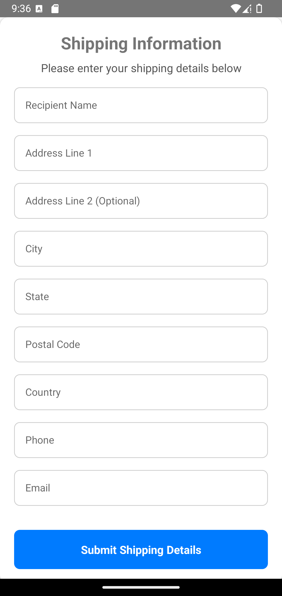
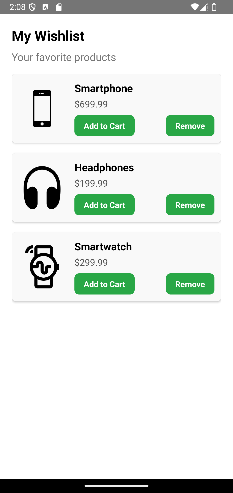

<p align="center">
  <a href="./README.md">🇺🇸 English Documentation</a> | 
  <a href="./README-pt.md">🇧🇷 Documentação em Português</a>
</p>

---

<h1 align="center">
  react-native-ecommerce-components
</h1>

<h5 align="center">
  Components to boost the development of your ecommerce.
</h5>

---

<p align="center">
  

  <a href="https://img.shields.io/github/repo-size/Danilo-Js/react-native-ecommerce-components/commits/master">
    
  </a>
  
  
  
  
</p>

<p align="center">
  <a href="https://img.shields.io/github/issues/Danilo-Js/react-native-ecommerce-components/issues">
    
  </a>

  

  <a href="https://www.npmjs.com/package/react-native-ecommerce-components">
    
  </a>
</p>

<p align="center">
  <a href="#information_source-about-the-project">About the project</a>&nbsp;&nbsp;&nbsp;|&nbsp;&nbsp;&nbsp;
  <a href="#clipboard-usage">Usage</a>&nbsp;&nbsp;&nbsp;|&nbsp;&nbsp;&nbsp;
  <a href="#memo-license">License</a>&nbsp;&nbsp;&nbsp;|&nbsp;&nbsp;&nbsp;
  <a href="Docs/English/HowToContribuite.md">How to contribute</a>&nbsp;&nbsp;&nbsp;|&nbsp;&nbsp;&nbsp;
  <a href="Docs/English/Diagrams.md">Diagrams</a>&nbsp;&nbsp;&nbsp;
</p>

---

## :information_source: **About the Project**

This project was created as part of a final paper for the Computer Science course at **UFES (Federal University of Espírito Santo)**.

Please leave a **_⭐ STAR_** on the [repository](https://github.com/Danilo-Js/react-native-ecommerce-components) and contribute to the library to help improve it further.

---

## 📸 **Components**

Click on the image to view the component documentation.

<table>
  <tr>
    <td align="center">
      <a href="Docs/English/Usage/CategoryList.md">
        <strong>Category List</strong><br/>
        
      </a>
    </td>
    <td align="center">
      <a href="Docs/English/Usage/CouponCodeInput.md">
        <strong>Coupon Code Input</strong><br/>
        
      </a>
    </td>
    <td align="center">
      <a href="Docs/English/Usage/NewClient.md">
        <strong>New Client Form</strong><br/>
        
      </a>
    </td>
    <td align="center">
      <a href="Docs/English/Usage/OrderConfirmation.md">
        <strong>Order Confirmation</strong><br/>
        
      </a>
    </td>
  </tr>
  <tr>
    <td align="center">
      <a href="Docs/English/Usage/OrderSummary.md">
        <strong>Order Summary</strong><br/>
        
      </a>
    </td>
    <td align="center">
      <a href="Docs/English/Usage/OrderTracking.md">
        <strong>Order Tracking</strong><br/>
        
      </a>
    </td>
    <td align="center">
      <a href="Docs/English/Usage/PaymentGateway.md">
        <strong>Payment Gateway</strong><br/>
        
      </a>
    </td>
    <td align="center">
      <a href="Docs/English/Usage/ProductDetail.md">
        <strong>Product Detail</strong><br/>
        
      </a>
    </td>
  </tr>
  <tr>
    <td align="center">
      <a href="Docs/English/Usage/ProductList.md">
        <strong>Product List</strong><br/>
        
      </a>
    </td>
    <td align="center">
      <a href="Docs/English/Usage/ReviewAndRatings.md">
        <strong>Review and Ratings</strong><br/>
        
      </a>
    </td>
    <td align="center">
      <a href="Docs/English/Usage/SearchBar.md">
        <strong>Search Bar</strong><br/>
        
      </a>
    </td>
    <td align="center">
      <a href="Docs/English/Usage/ShippingDetails.md">
        <strong>Shipping Details</strong><br/>
        
      </a>
    </td>
  </tr>
  <tr>
    <td align="center">
      <a href="Docs/English/Usage/ShoppingCart.md">
        <strong>Shopping Cart</strong><br/>
        
      </a>
    </td>
    <td align="center">
      <a href="Docs/English/Usage/WishList.md">
        <strong>Wish List</strong><br/>
        
      </a>
    </td>
  </tr>
</table>

---

## :clipboard: Usage

### **Installation**

To install the library, run one of the following commands:

```sh
yarn add react-native-ecommerce-components
```

or

```sh
npm install react-native-ecommerce-components
```

### **Using a Component**

1. **Import the desired component** in your project:

```js
import { NewClient } from "react-native-ecommerce-components/lib";
```

2. **Render the component:**

```js
<NewClient
  onSubmit={(data) => console.log(data)}
  fields={["Name", "Email"]}
  title="Customer Registration"
  subTitle="Fill out the form below"
/>
```

### **Editing Components in Node Modules**

If necessary, you can navigate to the following path:

```plaintext
node_modules/react-native-ecommerce-components/lib/components
```

Locate the desired component file and make your edits.

---

## :memo: **License**

This project is under the **MIT License**. See the [LICENSE](https://github.com/Danilo-Js/react-native-ecommerce-components/blob/master/LICENSE) file for details.

---

**Made with ❤️ by Danilo José Lima de Oliveira**  
[Get in touch!](https://www.linkedin.com/in/danilo-js/)
